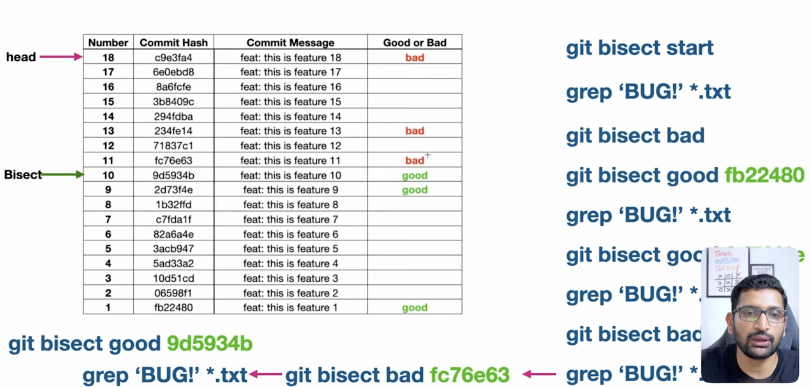

# Debug Commits

`git bisect` is a built-in Git debugging command that uses a binary search algorithm to pinpoint the exact commit that introduced a bug or regression into your codebase

By systematically dividing your commit history in half, it drastically minimizes the number of commits you need to manually check to find a faulty change



<br/>

## How it Works

```bash
# 1. Start the bisection
git bisect start

# 2. Tell Git the current version has the runtime bug
git bisect bad HEAD

# 3. Tell Git a historical commit hash or tag where the bug did NOT exist
git bisect good v2.1.0

# 4. Run the automation loop using Node.js
git bisect run node test-bug.js
```
