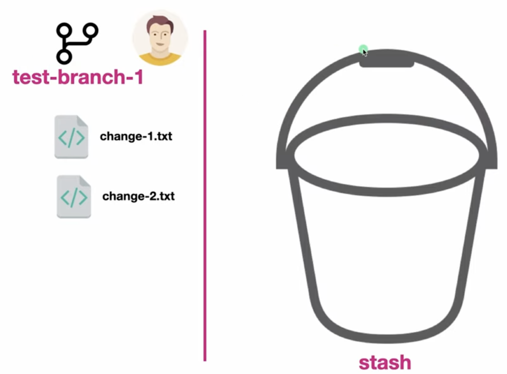
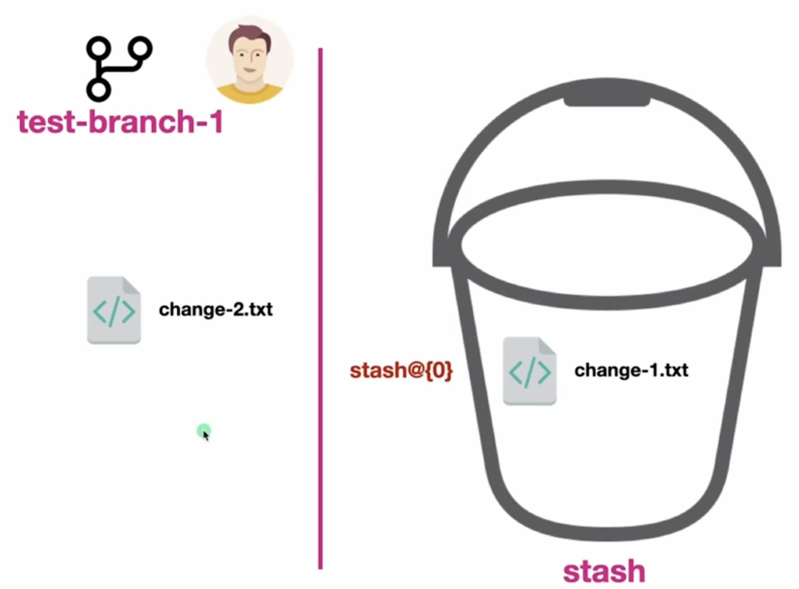

# Stashing

`git stash` is a command that temporarily shelves (stores) uncommitted local changes so you can work on something else, and then lets you re-apply them later

It takes your dirty working directory (modified tracked files and staged changes), saves them to an internal stack, and reverts your workspace back to a clean state matching the latest HEAD commit

 

## 💡 Primary Use Cases

**Context Switching:**
You are midway through a feature, but you must urgently switch branches to fix a critical bug without making an incomplete, messy commit

**Pulling into a Dirty Tree:**
You want to pull the latest remote changes via git pull, but Git blocks you because your local uncommitted modifications would be overwritten

**Code Experimentation:**
You want to quickly test a completely different approach without losing the experimental code you just wrote

 

## How this works

This is the current steup

**Saving Changes (Stashing)**

`git stash` or `git stash push`:
Saves your modified, tracked files and clears your workspace

`git stash push -m "Your description"`:
Highly recommended. Adds a specific label so you can easily identify what the stash contains later

`git stash -u (or --include-untracked)`:
Stashes newly created, untracked files along with your modifications

By default, standard stashing ignores new files that haven't been added to Git tracking yet

**Reviewing Stashed Work**

`git stash list`:
Shows your saved snapshots

They are stored as a stack-like structure, labeled from newest to oldest (e.g., `stash@{0}` is the most recent, `stash@{1}` is the one before it)

**Restoring Changes**

`git stash pop`:
Applies the most recent stash (`stash@{0}`) back to your working directory and permanently deletes it from the stash stack

`git stash apply`:
Restores the changes but keeps the snapshot saved in the stash list
This is safer if you want to apply the same changes across multiple branches

`git stash apply stash@{2}`:
Applies a specific historical stash from your list using its index number

**Cleaning Up**

`git stash drop stash@{0}`:
Manually deletes a specific stash entry without applying it

`git stash clear`:
Permanently deletes all stashes on your system. Warning: This action is destructive and cannot be undone
